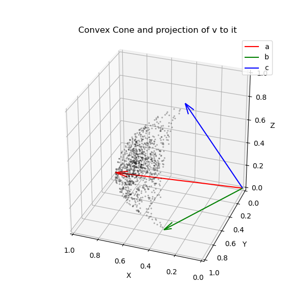
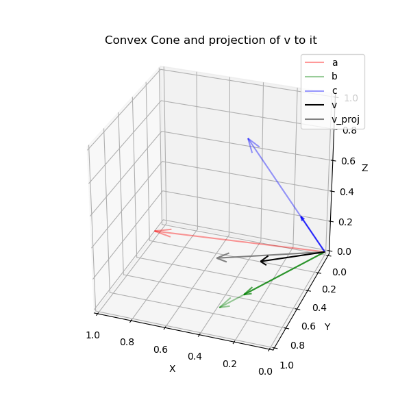
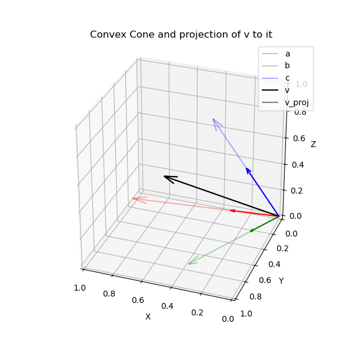

# convex-projection

This repo introduces a simple convex-optimization method that aims to find the best approximation to a target embedding based on a reduced set of relevant but diverse embeddings.

## HOW TO USE IT

### Installation

Before running any examples, you'll need to install the package from root directory of this repository. There you can run:

```
pip install .
```
This will install the `embedding_cvx_projection` package along with its dependencies.

### Running examples

Once the package is installed, you can try running the example scripts to understand how to effectively use this technique. Indeed, the `embedding_cvx_projection` package is very lean, so that this repository can be best understood as documentation and examples in how to use the given `cvxpy` projection technique.

#### Common nouns example

Before running this example you may need to have all modules in `requirements.txt` installed. And in case you want to use words not in the list `common_nouns` an openai api key. 

Then, after navigating to `examples/common_nouns` you can run:

```
python compose_meanings_in_meaning.py word1 word2 ...
```

With that you will get as output a list of all the words whose meanings can be generated combining the meanings of the input words.

For instance, executing
```
python compose_meanings_in_meaning.py prince sister heir
```
produces a list with `princess`, `person` and `daugther` in the top three positions.

### Synthetic retrieval example

Navigate to `examples/synthetic_retrieval` and run:

```
python redundant_unbalanced_contexts.py
```

The result (completely unspectacular) consists in a measure of the average _richness_ of the contexts extracted. That is, to how many different clusters do the retrieved contexts belong. The expectation is that, in this particular case, the higher the better, because then, the lower the redundancy. 

You can use different parameter to configure the problem differently.

## General problem

Given an input embedding `v`, the objective is to create a _composite embedding_ that closely approximates `v` by additively combining embeddings from a collection `M`. Closeness will be defined in terms of cosine similarity. We further assume that both `v` and the columns in `M` are normalized (which is the usual case for most available embeddings).

Graphically, this can be represented as projecting `v` to the convex cone produced by `M`. That the cone obtain by all the convex combinations of `M`.

### Convex cone


In this figure we have three vectors (`a`, `b` and `c`). All the dots are generated as (_normalized_) combinations of them three ad they define a surface section of the cone. Indeed, in this 3D example, the normalized vectors all land in the surface of the _normalized ball_ that is delimited by linking the vectors. Note that adding a fourth vector already inside the cone would not change its form, in the sense that it would not extend it.

### Projection to the convex cone 


If we then pose the question: _how close is a vector `v` to the space of all the combinations of `a`, `b` and `c`?_, we are then trying to find the closest _projection_ of our "query" vector in the cone generated by `a`, `b` and `c`. 

In terms of embeddings and semantic representations, this question how much in concept `v` implied by the combination of concepts  `a`, `b` and `c`.

Note that a key point is that `v` may be much closer to a certain combination of the vectors than to any of the individual vector itself, what makes the inference non-trivial. That is, it is not only about finding vectors close to the query vector, but finding how one can _smartly_ combine the a set of vectors to get as close as possible to the query vector.

### Decomposition of in convex combination



For instance, let's imagine that the green vector represent the embedding for `waterproofed` and the blue one `durable`, the black vector might represent `outdoors`, and what this decomposition would show is that the _meaning_ of `outdoors` is quite closely reconstructed by combining the meanings of `waterproofed` and `durable` in certain additive way. In other words, it is a mathematical way to ground the inference that something that is both `waterproofed` and `durable` is likely adequate for `outdoor`use.



Finally, this method can be also useful even when the query vector (or embedding) is already inside the cone (that is, `v` is already its projection in the cone). In that case, 

One can think of this as the case when a query vector is complex and contains many subtopics. By checking the coefficients of the convex projection, one would be able to retrieve the embeddings which are better aligned to the subtopics, and their relative _relevance_ (or _weight_).

## Applications:

This method can be useful in at least two generic use-cases:

- Decomposing a query embedding in non-redundant but similar embeddings, for instance with the aim of reducing redundancy in a retrieval step. 
- Finding whether an embedding that doesn't have a close match with any embedding in a given set can, nonetheless, be well-approximated by a combination of them, for instance when aiming to enrich the relationships in a Knowledge graph.

### Reducing redundancy in retrieval 
The first use-case relates to the Retrieval step in a Retrieval-Augmented Generation problem. In this scenario, similarity in the embedding space to an embedded query is used to retrieve a set of candidate contexts. However, relying on purely in similarity (ie, returning only the N most similar contexts to the query) may result in very similar, redundant contexts, which could penalize application performance. With this method, that problem is remediated by both the non-negativity constraint and the lasso penalty. That results in the system in retrieving vectors which are both relevant to the query (non-negativity) and diverse among themselves (lasso). 

### Extending Knowledge graphs

The second use-case could be relevant in the context of Knowledge graphs.

For instance, in an e-commerce set up, we have items (e.g., a products) and an extensive set of features that can be associated with those items (e.g., features). If the items are annotated manually, annotators may not be exhaustive and not assign all pertinent features with a given item. Assuming that we are provided with embeddings of all features, this method could assist in completing the annotation by inferring additional properties based on the ones already assigned. For example, in the product use case, if a given chair has been tagged as "_waterproof_" and "_durable_", this method could suggest "_outdoor_" as an appropriate additional tag, which could then be used to extend the annotation.

A related use case would when adding a new tag to an _ontology_. In that case, it would be possible to scan the already tagged items, suggesting the ones that could be annotated with it.

But also in the context of Knowledge graphs could be possible to use this mechanism in query time. Say that a user want to filter by the tag "_outdoor_", using this algorithm it could be possible to retrieve items that provide close match to the tag, even though not 1-to-1.


## Mathematical definition

In order to facilitate those use cases, this repo con a script to compute the projection of a point onto the convex set defined by the following optimization problem:


```math
min_x -v^T M x + beta ||x||_1
s.t. ||Mx||_2 <= 1
            x >= 0
```

### What does the mathematical formulation mean?

#### Maximization objective

First, our goal is to find the mixing coefficients `x`, that applied to `M` produce a vector which is closer to `v`. Giving the coefficients `x`, then the composite embedding is `Mx`. Since we define proximity in terms of cosine similarity, and assuming the composite embedding is as well normalized, maximizing proximity is achieved by maximizing the dot-product `v.T(Mx)` (or minimizing its negative version). 

In order to avoid redundancy, a lasso penalty term is added to the objective (also known as a l1-regularizer), which weighted by the constant `beta`.

#### Constraints

The non-negative constraint `x>=0` ensures that we combine the embeddings in an additive manner, which is relevant provided they if the embeddings represent things like features, topics,that should be combined but not "negated". Like that, we obtain an easy interpretable decomposition of the target embedding in its found "components".

Finally the constraint `||Mx||_2 <= 1` ensures that we are going to maximize the cosine similarity by combining the columns of `M` into a vector that has at most Euclidean norm equal to 1. By the dynamics of the maximization of `v.T (Mx)`, the solver would respect this constraint while driving the norm of `Mx` to 1, up to the solver precision. That will ensure that `Mx` is normalized and that its dot product with `v` yields the cosine similarity.

## CVXPY implementation

What can be translated to the cvxpy problem:

```python
x = cp.Variable(M.shape[1])

prob = cp.Problem(
    cp.Minimize(-v.T @ M @ x + beta * cp.sum(x)),
    [cp.norm2(M @ x) <= 1.0, x >= 0]
)
```

The only difference with the mathematical formulation is that instead of a lasso penalty/regularization, one can write simply a sum penalty, as we know from the constraint below that all weights are non-negative.

### Optional extension

In some cases, one may want to add a further constraint, `x <= gamma * cp.sum(x)`, where `gamma` is between 0 and 1. Setting `gamma` to e.g. `0.9` will ensure that the mixture in `M` is non-trivial (in the sense that the combination is simply achieved by providing a synonym). The lower we set this parameter, the more we are asking the algorithm to reconstruct `v` with a set of vectors which are dissimilar to it. If we think it as a cooking metaphor, we are replacing an ingredient by another similar one, but with a set of different, that, aggregated achieve the same effect.

One note of caution: if one adds this additional constraint, the number of embeddings in `M` needs to be greater than (`1/gamma`), otherwise the constraint is not satisfiable.


## Examples

This repo contains two toy examples to illustrate the possible applications mentioned above.

### Simulated RAG retrieval with redundant contexts

The first toy-example simulates the problem of retrieving a query embedding from DB that contains many redundant ones. The problem is abstracted as producing a random vector by combining 4 different vectors. At its term, we generate a cluster around each of the 4 _seed_ vectors, but with a very unbalanced number of member (exponentially unbalanced). Indeed, cluster 4 has 900 similar members, while cluster is composed of just one vector. 

The desired behavior would be to retrieve in the top N "hits" embeddings belonging to different classes, s.t. we can return diverse information that captures all the info. Indeed, running the simulation, specially for configurations where the coherence of the clusters is high, the convex projection is the _embedding retrieval_ method returning components from greater number of source clusters in the first N hits (e.g., with `N=5` or `10`). In any case, it clearly retrieves more diverse embeddings than the pure search by similarity.

### Composing word meanings into other word meanings

The second toy example aims to illustrate a case related to the one of adding features to an entity based on the features it already has. That can be seen as something similar to extending a knowledge graph.

However, the example deals simply with common nouns. Then, given an input list of nouns, it looks how to combine them to get as close as possible to every word in a given set of words (stored in a library of embeddings). The it lists the results according to the quality of the approximation. For instance, combining the meanings of _lava_ and _mountain_ we are close to the meaning of _volcano_; combining _religion_ and _mortgage_ we get _marriage_; and with _kingdom_ plus _ruler_ we are close to _monarch_. 

### Beyond trivial results 

These examples are reminiscent of the famous _king_ - _man_ + _woman_ = _queen_. Is it then this method just a complex way of getting the same? That is, it is simply true that _mountain_ + _lava_ = _volcano_? Indeed, with the constructed examples above, the result may not differ too much. However, the key advantage of computing these projections, is that in checking for the best (convex) combination, the algorithm can completely ignore words that do not add up to the results, or combine words in disjoint subsets for different suggestions. For instance, if we give it as input the complete list containing _lava_, _mountain_, _religion_, _mortgage_, _kingdom_ and _ruler_, instead of looking to the average embedding of all of them, it can select subsets to find better matches. 

The algorithm that provides this result, not only checks how close the combined embedding is to the target word, it also measures how much _closer_ it is than any single of the words in the combination is. That way it filters out results with simply near-synonyms.

## Novelty?

### _Is this method novel? How does it compare to others?_

There's no way on earth for neither this method nor its application to the domain of reasoning with embeddings to be novel. The convex problem definition is far too simple for it and the application far too obvious. Moreover, I must admit that least squares constrained to positive coefficients (which is, as well, a convex-optimization problem) is a well-known tool in data science, of which non-negative matrix factorizations are usual and very powerful extensions. 

However, I would favor this cosine-similarity maximization to the least squares minimization if only because it is consistent with the similarity measure most used in the context of word-embeddings, namely the cosine-similarity or the dot-product of normalized embeddings.

### _If it isn't novel, why this repo? why bother?_

Even if it isn't novel, these techniques surely don't attract all the attention they deserve in the wide community. Now that LLMs and Vector DBs have driven embedding adoption to a new scale, the community would probably advance faster and get better results if it would embrace these simple, but mathematically well-grounded, tricks.

## Summary 

This repository presents a convex-optimization method designed for approximating target embeddings using a reduced set of diverse and relevant embeddings. Utilizing cosine similarity as the measure of closeness, the method projects a given embedding onto a convex cone defined by a collection of other embeddings. 

The approach is particularly useful in two main scenarios: 1) Reducing redundancy during retrieval in Retrieval-Augmented Generation tasks, and 2) Enriching relationships in Knowledge Graphs by approximating unannotated entities based on existing annotations.

The method is implemented using CVXPY and provides a mathematical formulation that maximizes cosine similarity while adhering to specific constraints, offering both relevance and diversity in the results. 

Even this may be a known technique and belong to a well-known family of solutions, this repo aims to bridge the gap of its current under-utilization in the domain LLMs and vector DBs.


