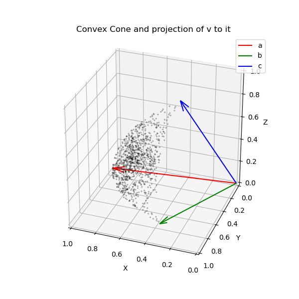
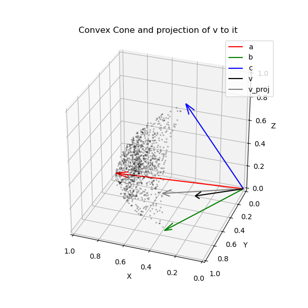
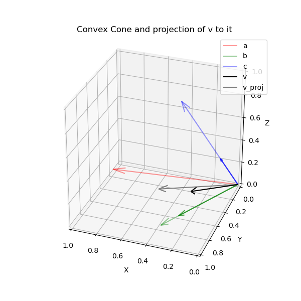
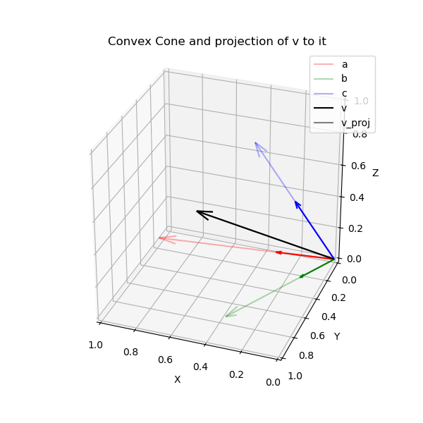

# Why using convex projections with embeddings?

_This document is currently a draft. A revised version will be updated soon._ 

This repo introduces a simple convex-optimization method that aims to find the best approximation to a target embedding based on a reduced set of relevant but diverse embeddings.

The operation achieved is analogous to answering the question: _how can I best explain my input embedding by _meaningfully_ combining embeddings in the set embeddings set?_.

Presumed applications for it are a) retrieving relevant but diverse contexts in the retrieval step of Retrieval Augmented Generation workflow (RAG) or b) extending knowlege graphs by inferring relationships.

For instruction on _how to use_ please check the [README.md](../README.md) file at the root of this repo.


## General problem

Given an input embedding `v`, the objective is to create a _composite embedding_ that closely approximates `v` by additively combining embeddings from a collection `M`. Closeness will be defined in terms of cosine similarity. We further assume that both `v` and the columns in `M` are normalized (which is the usual case for most available embeddings).

Graphically, this can be represented as projecting `v` to the convex cone produced by `M`. That the cone obtain by all the convex combinations of `M`.

### Convex cone


In this figure we have three vectors (`a`, `b` and `c`). All the dots are generated as (_normalized_) combinations of them three ad they define a surface section of the cone. Indeed, in this 3D example, the normalized vectors all land in the surface of the _normalized ball_ that is delimited by linking the vectors. Note that adding a fourth vector already inside the cone would not change its form, in the sense that it would not extend it.

### Projection to the convex cone 


If we then pose the question: _how close is a vector `v` to the space of all the combinations of `a`, `b` and `c`?_, we are then trying to find the closest _projection_ of our "query" vector in the cone generated by `a`, `b` and `c`. 

In terms of embeddings and semantic representations, this question how much in concept `v` implied by the combination of concepts  `a`, `b` and `c`.

Note that a key point is that `v` may be much closer to a certain combination of the vectors than to any of the individual vector itself, what makes the inference non-trivial. That is, it is not only about finding vectors close to the query vector, but finding how one can _smartly_ combine the a set of vectors to get as close as possible to the query vector.

### Decomposition of in convex combination



For instance, let's imagine that the green vector represent the embedding for `waterproofed` and the blue one `durable`, the black vector might represent `outdoors`, and what this decomposition would show is that the _meaning_ of `outdoors` is quite closely reconstructed by combining the meanings of `waterproofed` and `durable` in certain additive way. In other words, it is a mathematical way to ground the inference that something that is both `waterproofed` and `durable` is likely adequate for `outdoor`use.



Finally, this method can be also useful even when the query vector (or embedding) is already inside the cone (that is, `v` is already its projection in the cone). In that case, the task is analogous to one of explaining a certain input in terms of known inputs. Like decomposing a composite concept in its simpler constituents.

For instance, one can think of this as the case when a query vector is complex and contains many subtopics. By checking the coefficients of the convex projection, one would be able to retrieve the embeddings which are better aligned to the subtopics, and their relative _relevance_ (or _weight_).

## Applications

This method can be useful in at least two generic use-cases:

- Decomposing a query embedding in non-redundant but similar embeddings, for instance with the aim of reducing redundancy in a retrieval step. 
- Finding whether an embedding that doesn't have a close match with any embedding in a given set can, nonetheless, be well-approximated by a combination of them, for instance when aiming to enrich the relationships in a Knowledge graph.

### Reducing redundancy in retrieval 
The first use-case relates to the Retrieval step in a Retrieval-Augmented Generation problem. In this scenario, similarity in the embedding space to an embedded query is used to retrieve a set of candidate contexts. However, relying on purely in similarity (ie, returning only the N most similar contexts to the query) may result in very similar, redundant contexts, which could penalize application performance. With this method, that problem is remediated by both the non-negativity constraint and the lasso penalty. That results in the system in retrieving vectors which are both relevant to the query (non-negativity) and diverse among themselves (lasso). 

### Extending Knowledge graphs

The second use-case could be relevant in the context of Knowledge graphs.

For instance, in an e-commerce set up, we have items (e.g., a products) and an extensive set of features that can be associated with those items (e.g., features). If the items are annotated manually, annotators may not be exhaustive and not assign all pertinent features with a given item. Assuming that we are provided with embeddings of all features, this method could assist in completing the annotation by inferring additional properties based on the ones already assigned. For example, in the product use case, if a given chair has been tagged as "_waterproof_" and "_durable_", this method could suggest "_outdoor_" as an appropriate additional tag, which could then be used to extend the annotation.

A related use case would when adding a new tag to an _ontology_. In that case, it would be possible to scan the already tagged items, suggesting the ones that could be annotated with it.

But also in the context of Knowledge graphs could be possible to use this mechanism in query time. Say that a user want to filter by the tag "_outdoor_", using this algorithm it could be possible to retrieve items that provide close match to the tag, even though not 1-to-1.


## Mathematical definition

In order to facilitate those use cases, this repo con a script to compute the projection of a point onto the convex set defined by the following optimization problem:


$$
\begin{align*}
\min_x \quad & -v^T M x + \beta \|x\|_1 \\
\text{s.t.} \quad & \|Mx\|_2 \leq 1 \\
& x \geq 0
\end{align*}
$$

### What does the mathematical formulation mean?

#### Maximization objective

First, our goal is to find the mixing coefficients `x`, that applied to `M` produce a vector which is closer to `v`. Giving the coefficients `x`, then the composite embedding is `Mx`. Since we define proximity in terms of cosine similarity, and assuming the composite embedding is as well normalized, maximizing proximity is achieved by maximizing the dot-product `v.T(Mx)` (or minimizing its negative version). 

In order to avoid redundancy, a lasso penalty term is added to the objective (also known as a l1-regularizer), which weighted by the constant `beta`.

#### Constraints

The non-negative constraint `x>=0` ensures that we combine the embeddings in an additive manner, which is relevant provided they if the embeddings represent things like features, topics,that should be combined but not "negated". Like that, we obtain an easy interpretable decomposition of the target embedding in its found "components".

Finally the constraint `||Mx||_2 <= 1` ensures that we are going to maximize the cosine similarity by combining the columns of `M` into a vector that has at most Euclidean norm equal to 1. By the dynamics of the maximization of `v.T (Mx)`, the solver would respect this constraint while driving the norm of `Mx` to 1, up to the solver precision. That will ensure that `Mx` is normalized and that its dot product with `v` yields the cosine similarity.

## CVXPY implementation

What can be translated to the cvxpy problem:

```python
x = cp.Variable(M.shape[1])

prob = cp.Problem(
    cp.Minimize(-v.T @ M @ x + beta * cp.sum(x)),
    [cp.norm2(M @ x) <= 1.0, x >= 0]
)
```

The only difference with the mathematical formulation is that instead of a lasso penalty/regularization, one can write simply a sum penalty, as we know from the constraint below that all weights are non-negative.

### Optional extension

In some cases, one may want to add a further constraint, `x <= gamma * cp.sum(x)`, where `gamma` is between 0 and 1. Setting `gamma` to e.g. `0.9` will ensure that the mixture in `M` is non-trivial (in the sense that the combination is simply achieved by providing a synonym). The lower we set this parameter, the more we are asking the algorithm to reconstruct `v` with a set of vectors which are dissimilar to it. If we think it as a cooking metaphor, we are replacing an ingredient by another similar one, but with a set of different, that, aggregated achieve the same effect.

One note of caution: if one adds this additional constraint, the number of embeddings in `M` needs to be greater than (`1/gamma`), otherwise the constraint is not satisfiable.


